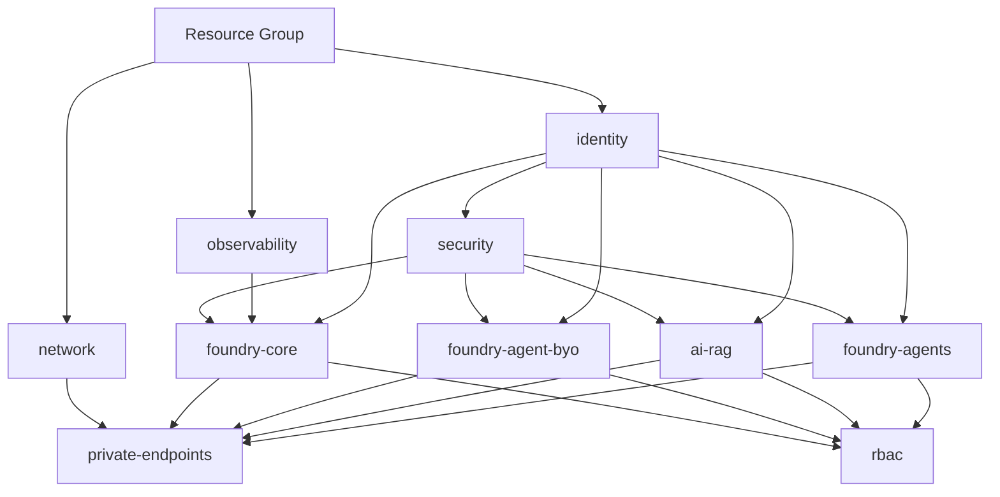

# Terraform モジュール設計ドキュメント

このドキュメントは、Microsoft Foundry Workshop の Terraform IaC を再設計した際の
モジュール構成、設計方針、および考慮事項を記録したものです。

## 設計目標

- 既存の `basic/` フォルダには一切変更を加えない
- `basic`, `standard`, `standard-vnet-injection` の 3 種類の展開方法を、
  共通モジュールの組み合わせで構成する
- 各モジュールの責務を明確にし、管理・拡張を容易にする

---

## モジュール一覧

| モジュール          | 役割                                                               |
| ------------------- | ------------------------------------------------------------------ |
| `identity`          | UAMI (CMK 用 User-assigned Managed Identity)                       |
| `security`          | CMK 専用 Key Vault + 暗号鍵 + CMK RBAC                             |
| `observability`     | Log Analytics + Application Insights                               |
| `foundry-core`      | Foundry Account + Project + Deployments + 接続情報 Key Vault (opt) |
| `foundry-agents`    | ACR (新規/既存) + Hosted Agent 実行基盤                            |
| `foundry-agent-byo` | Agent BYO: Cosmos DB + Storage + AI Search                         |
| `ai-rag`            | 顧客 RAG: AI Search + Blob Storage                                 |
| `network`           | VNet + Subnets (PE / Agent) + NSG + Private DNS Zones              |
| `private-endpoints` | Private Endpoint 集約                                              |
| `rbac`              | 横断的 RBAC 割り当て                                               |

---

## 展開ティアごとのモジュール構成

| モジュール             | basic | standard | standard-vnet-injection |
| ---------------------- | :---: | :------: | :---------------------: |
| `observability`        |  ✅   |    ✅    |           ✅            |
| `foundry-core`         |  ✅   |    ✅    |           ✅            |
| `foundry-agents` (ACR) |  ✅   |    ✅    |           ✅            |
| `identity` (UAMI)      |   —   |    ✅    |           ✅            |
| `security` (CMK KV)    |   —   |    ✅    |           ✅            |
| `foundry-agent-byo`    |   —   |    ✅    |           ✅            |
| `ai-rag`               |   —   |    ✅    |           ✅            |
| `network`              |   —   |    —     |           ✅            |
| `private-endpoints`    |   —   |    —     |           ✅            |
| `rbac`                 |  ✅   |    ✅    |           ✅            |

---

## 展開順序（依存グラフ）



---

## ファイル命名規則

各モジュール内のファイルは、関心事 (concern) ごとにサフィックスで分割できる命名規則を採用する。

| パターン                        | 用途                                    | 例                                                          |
| ------------------------------- | --------------------------------------- | ----------------------------------------------------------- |
| `main.tf`                       | メインリソース定義 (単一関心事の場合)   | `main.tf`                                                   |
| `main.<concern>.tf`             | 関心事別リソース定義                    | `main.account.tf`, `main.project.tf`, `main.connections.tf` |
| `variables.tf`                  | 入力変数 (単一ファイルの場合)           | `variables.tf`                                              |
| `variables.<concern>.tf`        | 関心事別入力変数                        | `variables.network.tf`, `variables.cmk.tf`                  |
| `locals.tf`                     | ローカル値 (単一ファイルの場合)         | `locals.tf`                                                 |
| `locals.<concern>.tf`           | 関心事別ローカル値                      | `locals.naming.tf`, `locals.defaults.tf`                    |
| `outputs.tf`                    | 出力値 (分割しない)                     | `outputs.tf`                                                |
| `versions.tf`                   | required_providers / terraform ブロック | `versions.tf`                                               |
| `data.tf` / `data.<concern>.tf` | data sources                            | `data.tf`, `data.existing.tf`                               |

### 設計原則

- `outputs.tf` は分割せず 1 ファイルに集約する (モジュールの公開インターフェースを一覧化するため)
- `versions.tf` は各モジュールに 1 つ、required_providers を宣言する
- 小規模モジュール (`identity` 等) は `main.tf` + `variables.tf` + `outputs.tf` のみで構成して良い
- 関心事の分割が適切な場合のみサフィックスを使用し、過度な分割は避ける

---

## 各モジュールの設計詳細

### `identity`

- CMK 用 User-assigned Managed Identity を **サービスごとに個別に** 作成
- Standard 以上の展開で使用
- 各 UAMI は対応する鍵にのみアクセス権を持つ (鍵レベル RBAC)
- 例: `uami-cmk-ai-services`, `uami-cmk-acr`, `uami-cmk-storage`

### `security`

- **CMK 専用** Key Vault + 暗号鍵のみ
- Purge Protection: 必須 (CMK 要件)
- SKU: Premium 推奨 (HSM バックアップ鍵に対応)
- アクセスモデル: RBAC (Access Policy は使用しない)
- RBAC ロール: `Key Vault Crypto Service Encryption User` (UAMI → KV)
- 鍵ローテーション: 自動ローテーションポリシーを有効化
- **接続情報用 Key Vault はここに含めない** (`foundry-core` 内に配置)

### `observability`

- Log Analytics Workspace
- Application Insights (Log Analytics に紐付け)
- 早期にデプロイして各リソースに紐付ける設計
- 既存の共有監視リソースを参照するオプション (`create_observability = false`)

### `foundry-core`

- Foundry Account (`Microsoft.CognitiveServices/accounts`, kind=AIServices)
- Foundry Project (`Microsoft.CognitiveServices/accounts/projects`)
- Model Deployments (GPT-4.1, text-embedding-3-small 等)
- **接続情報用 Key Vault** (オプション、BYO KV Connection として)
- Foundry Connections (KV, AI Search, App Insights)
- **VNet Injection パラメータ**: 初回作成時に Agent Subnet ID を渡す
  - ⚠️ 後から VNet Injection を追加することは不可
- Foundry Project MI → Foundry Account への `Foundry User` ロール割り当て

### `foundry-agents`

- Azure Container Registry (新規作成 or 既存参照)
- `create_acr` / `existing_acr_id` で切り替え
- ⚠️ **ACR は private 化不可** (Hosted Agent の制約)
  - VNet Injection 展開でも `public_network_access_enabled = true` が必須
- CMK 対応 (Premium SKU に自動昇格)
- 将来的に ACA (Azure Container Apps) 実行基盤を追加可能

### `foundry-agent-byo`

- Azure Cosmos DB for NoSQL (Agent の会話履歴・スレッド状態)
- Azure Storage Account (Agent のファイル保管)
- Azure AI Search (Agent のベクトルストア)
- **Cosmos DB スループット要件:**
  - 最小: 3,000 RU/s (1 プロジェクト, Classic Agent のみ)
  - 推奨: 5,000 RU/s (1 プロジェクト, Responses API Agent 使用)
  - 計算式: 5,000 × プロジェクト数 (Responses API)
  - Serverless モードもサポート
- ⚠️ スループット不足 = Capability Host プロビジョニング失敗

### `ai-rag`

- Azure AI Search (顧客のグラウンディング用)
- Azure Blob Storage (RAG 用ドキュメント保管)
- `foundry-agent-byo` とは物理的・論理的に分離
  - セキュリティ: ブラスト半径の最小化
  - ライフサイクル: インデックス更新とエージェントメモリリセットが独立

### `network`

- VNet
- **PE Subnet** (Private Endpoints 用)
- **Agent Subnet** (delegated to `Microsoft.App/environments`)
  - ⚠️ 推奨サイズ: /24 (256 addresses)
  - ⚠️ Foundry リソースごとに**専用サブネットが必要** (共有不可)
  - ⚠️ VNet と Foundry リソースは**同一リージョン必須**
- NSG
- Private DNS Zones
- 既存 DNS Zone の参照オプション (Hub-Spoke / Connectivity subscription)

### `private-endpoints`

- すべてのリソースの Private Endpoint を集約して最後に作成
- ⚠️ **BYO リソースの PE は Foundry が自動作成しない** — IaC で明示的に作成必須
- DNS Zone 紐付け
- 対象リソースと DNS Zone:

  | リソース  | subresource   | Private DNS Zone                                                                                               |
  | --------- | ------------- | -------------------------------------------------------------------------------------------------------------- |
  | Foundry   | account       | `privatelink.cognitiveservices.azure.com`, `privatelink.openai.azure.com`, `privatelink.services.ai.azure.com` |
  | AI Search | searchService | `privatelink.search.windows.net`                                                                               |
  | Cosmos DB | Sql           | `privatelink.documents.azure.com`                                                                              |
  | Storage   | blob          | `privatelink.blob.core.windows.net`                                                                            |
  | Key Vault | vault         | `privatelink.vaultcore.azure.net`                                                                              |

### `rbac`

- **ユーザー/グループ RBAC のみ**を管理 (Deployer, Developer Group, User Group)
- サービス間 RBAC は各リソースモジュール内で定義 (下記「RBAC 配置戦略」参照)
- User/Group ベースの RBAC

---

## RBAC 配置戦略

サービス間 RBAC はリソースのライフサイクルに合わせ、各モジュール内に配置する。
ユーザー/グループ RBAC は横断的なため `rbac` モジュールに集約する。

### サービス間 RBAC (各モジュール内 `main.rbac.tf`)

| RBAC 割り当て                              | 配置先モジュール | ファイル       |
| ------------------------------------------ | ---------------- | -------------- |
| Foundry Account MI → Key Vault             | `foundry-core`   | `main.rbac.tf` |
| (Key Vault Secrets Officer)                |                  |                |
| Foundry Project MI → Foundry Account       | `foundry-core`   | `main.rbac.tf` |
| (Cognitive Services User)                  |                  |                |
| Foundry Project MI → ACR                   | `foundry-agents` | `main.rbac.tf` |
| (AcrPull)                                  |                  |                |
| UAMI → Key Vault (CMK)                     | `security`       | (将来実装)     |
| (Key Vault Crypto Service Encryption User) |                  |                |

### ユーザー/グループ RBAC (`rbac` モジュール)

| ロール             | スコープ                                  |
| ------------------ | ----------------------------------------- |
| Azure AI Owner     | Foundry Account/Project (Deployer)        |
| Azure AI Developer | Foundry Account/Project (Developer Group) |
| Azure AI User      | Foundry Account/Project (User Group)      |

### RBAC 伝播待機パターン

Azure RBAC は eventually consistent のため、RBAC 割り当て後に権限が有効になるまで
遅延が発生する。下流リソース (Connections 等) の作成前に `time_sleep` で待機する:

```hcl
resource "time_sleep" "wait_for_keyvault_rbac_propagation" {
  count           = var.enable_keyvault ? 1 : 0
  create_duration = var.rbac_propagation_wait_duration  # default: "60s"

  depends_on = [azurerm_role_assignment.foundry_account_to_keyvault]
}

resource "azapi_resource" "keyvault_connection" {
  # ...
  depends_on = [time_sleep.wait_for_keyvault_rbac_propagation]
}
```

---

## 変数設計パターン

### オプショナルリソースの有効化判定

`enable_*` ブール変数は、対象リソースの ID/Key が自然に存在しない場合にのみ使用する。
ID や Key が存在する場合は、その値の有無 (`!= ""`) で判定する:

| パターン               | 使用場面               | 例                                            |
| ---------------------- | ---------------------- | --------------------------------------------- |
| `var.xxx_id != ""`     | 外部リソース接続       | `var.app_insights_id != ""` → Connection 作成 |
| `var.xxx_key_id != ""` | CMK 有効化             | `var.foundry_cmk_key_vault_key_id != ""`      |
| `var.enable_xxx`       | リソース自体の作成制御 | `var.enable_keyvault` → Key Vault 作成        |

### 既存/新規リソースの切り替え (`observability` モジュール)

```hcl
variable "use_existing" {
  description = "Whether to reference existing resources instead of creating new ones"
  type        = bool
  default     = false
}

resource "azurerm_log_analytics_workspace" "this" {
  count = var.use_existing ? 0 : 1
  # ...
}

data "azurerm_log_analytics_workspace" "this" {
  count = var.use_existing ? 1 : 0
  # ...
}
```

---

## Key Vault 分離設計

| Key Vault          | 用途                                  | 配置先モジュール | 展開ティア           |
| ------------------ | ------------------------------------- | ---------------- | -------------------- |
| CMK Key Vault      | 暗号鍵のみ                            | `security`       | Standard 以上        |
| 接続情報 Key Vault | Foundry Connection のシークレット管理 | `foundry-core`   | Basic からオプション |

### 分離理由

- 最小権限の原則: CMK UAMI に接続情報への不要なアクセス権が発生しない
- Blast Radius: 一方の侵害が他方に波及しない
- ライフサイクル: CMK 鍵のローテーションと接続情報の更新が独立
- Purge Protection: CMK KV は必須、接続情報 KV は環境に応じて柔軟

### BYO Key Vault の制約

- Foundry リソースにつき **1 つの Key Vault Connection のみ** 登録可能
- CMK KV は Connection に登録しないため問題なし
- `foundry-core` 内の接続情報 KV が唯一の BYO KV Connection になる

---

## CMK (Customer-managed Key) 設計

### Managed Identity の選択: User-assigned MI を推奨

| 観点                 | System-assigned MI | User-assigned MI (推奨)               |
| -------------------- | ------------------ | ------------------------------------- |
| ライフサイクル       | リソースと連動     | 独立管理                              |
| 事前プロビジョニング | 不可               | 可能                                  |
| 循環依存の回避       | 順序問題あり       | Identity を先に作成 → RBAC → サービス |
| IaC での扱い         | `depends_on` 必要  | 宣言的に記述しやすい                  |

### UAMI の分離: サービスごとに個別の UAMI を推奨

| 観点             | 共有 UAMI (1つ)                | 個別 UAMI (推奨)               |
| ---------------- | ------------------------------ | ------------------------------ |
| 最小権限         | Vault 全体にアクセス可能       | 鍵レベルでスコープ可能         |
| Blast Radius     | UAMI 侵害で全鍵アクセス        | 影響範囲が特定サービスに限定   |
| 鍵ローテーション | 1 UAMI が全鍵にアクセス        | サービスごとに独立した権限管理 |
| 監査             | どのサービスのアクセスか不明瞭 | サービス単位で明確に追跡可能   |

推奨構成:

```text
UAMI-ai-services  →  Key: key-ai-services   (スコープ: 鍵レベル RBAC)
UAMI-acr          →  Key: key-acr           (スコープ: 鍵レベル RBAC)
UAMI-storage      →  Key: key-storage       (スコープ: 鍵レベル RBAC)
UAMI-cosmos       →  Key: key-cosmos        (スコープ: 鍵レベル RBAC)
```

### 鍵の分離: サービスごとに個別の鍵を推奨

```text
Key Vault (CMK専用)
├── key-ai-services   ← Foundry Account 用
├── key-acr           ← Container Registry 用
├── key-storage       ← Storage Account 用
└── key-cosmos        ← Cosmos DB 用
```

### CMK 変数命名規則

CMK 関連の変数名には対象リソースを明示するプレフィックスを付ける:

| モジュール          | 変数プレフィックス            | 例                             |
| ------------------- | ----------------------------- | ------------------------------ |
| `foundry-core`      | `foundry_cmk_`                | `foundry_cmk_key_vault_key_id` |
| `foundry-agents`    | `acr_cmk_`                    | `acr_cmk_key_vault_key_id`     |
| `foundry-agent-byo` | `cosmos_cmk_`, `storage_cmk_` | (将来実装)                     |

### CMK 有効化判定パターン

`enable_cmk` ブール変数は使用しない。Key ID の有無で判定する:

```hcl
locals {
  enable_foundry_cmk = var.foundry_cmk_key_vault_key_id != ""
}
```

これにより:

- 呼び出し元での二重指定ミス (`enable_cmk = true` だが key が空) を防止
- `app_insights_id != ""` パターンと統一

### RBAC 前提条件

CMK の RBAC (`Key Vault Crypto Service Encryption User`: UAMI → Key Vault) は
`identity` / `security` モジュールで設定済みの前提。各リソースモジュールは
UAMI ID と Key ID を受け取るのみ。

---

## プラットフォーム制約事項 (2026年5月時点)

1. **ACR は private 化不可** (Hosted Agent): ACR は public endpoint が必須。
   [Virtual Networks — Limitations](https://learn.microsoft.com/en-us/azure/foundry/agents/how-to/virtual-networks#limitations),
   [Hosted Agents — Private networking](https://learn.microsoft.com/en-us/azure/foundry/agents/concepts/hosted-agents#private-networking)
2. **VNet Injection は後付け不可** (Hosted Agent): 初回 Foundry Account 作成時のみ設定可能。
   [Virtual Networks — Limitations](https://learn.microsoft.com/en-us/azure/foundry/agents/how-to/virtual-networks#limitations)
3. **Agent Subnet は専用** (Hosted Agent): Foundry リソースごとに dedicated subnet が必要。
   [Virtual Networks — Limitations](https://learn.microsoft.com/en-us/azure/foundry/agents/how-to/virtual-networks#limitations)
4. **BYO リソースの PE は自動作成されない** (ネットワーク): IaC で明示的に作成必須。
   [Virtual Networks — Configure a network-secured environment](https://learn.microsoft.com/en-us/azure/foundry/agents/how-to/virtual-networks#configure-a-network-secured-environment)
5. **Cross-subscription 接続不可** (ネットワーク): Foundry と Azure OpenAI は同一サブスクリプション。
   [Use your own resources — Limitations](https://learn.microsoft.com/en-us/azure/foundry/agents/how-to/use-your-own-resources#limitations)
6. **VNet と Foundry は同一リージョン必須** (ネットワーク)。
   [Virtual Networks — Limitations](https://learn.microsoft.com/en-us/azure/foundry/agents/how-to/virtual-networks#limitations)
7. **スループット不足 = デプロイ失敗** (Cosmos DB): Capability Host プロビジョニングが失敗する。
   [Use your own resources — Azure Cosmos DB](https://learn.microsoft.com/en-us/azure/foundry/agents/how-to/use-your-own-resources#azure-cosmos-db-for-nosql-to-store-conversations)
8. **3-5 コンテナ/プロジェクト** (Cosmos DB): 各 1,000 RU/s 必要。
   [Use your own resources — Azure Cosmos DB](https://learn.microsoft.com/en-us/azure/foundry/agents/how-to/use-your-own-resources#azure-cosmos-db-for-nosql-to-store-conversations)
9. **BYO KV は 1 Foundry につき 1 つ** (Key Vault): 複数の KV Connection は不可。
   [Set up Key Vault connection — Limitations](https://learn.microsoft.com/en-us/azure/foundry/how-to/set-up-key-vault-connection#limitations)
10. **KV 削除 = Foundry 破損** (Key Vault): BYO KV を削除すると接続が壊れる。
    [Set up Key Vault connection — Limitations](https://learn.microsoft.com/en-us/azure/foundry/how-to/set-up-key-vault-connection#limitations)
11. **CapabilityHost は Connections に依存** (Hosted Agent): ACR Connection 等が事前に存在する必要がある。
    [Virtual Networks — Deployment errors](https://learn.microsoft.com/en-us/azure/foundry/agents/how-to/virtual-networks#deployment-errors),
    [Set up Key Vault connection — IaC templates](https://learn.microsoft.com/en-us/azure/foundry/how-to/set-up-key-vault-connection#infrastructure-as-code-templates)

---

## Resource Provider 事前登録

各展開前に以下のプロバイダー登録が必要:

```bash
az provider register --namespace 'Microsoft.KeyVault'
az provider register --namespace 'Microsoft.CognitiveServices'
az provider register --namespace 'Microsoft.Storage'
az provider register --namespace 'Microsoft.MachineLearningServices'
az provider register --namespace 'Microsoft.Search'
az provider register --namespace 'Microsoft.Network'
az provider register --namespace 'Microsoft.App'
az provider register --namespace 'Microsoft.ContainerService'
# Bing Search ツール利用時のみ
az provider register --namespace 'Microsoft.Bing'
```

---

## Firewall Allowlist (VNet Injection + Azure Firewall 構成時)

| 用途                 | 許可する FQDN                                                                                   |
| -------------------- | ----------------------------------------------------------------------------------------------- |
| Agents               | `*.identity.azure.net`, `login.microsoftonline.com`, `*.login.microsoft.com` or AAD Service Tag |
| Evaluations & Traces | `*.blob.core.windows.net`, `settings.sdk.monitor.azure.com`                                     |
| Finetuning           | `raw.githubusercontent.com`                                                                     |

---

## サブネット設計 (`network` モジュール)

```text
VNet (例: 192.168.0.0/16)
├── Agent Subnet     : 192.168.0.0/24  (delegation: Microsoft.App/environments)
├── PE Subnet        : 192.168.1.0/24  (Private Endpoints)
└── App Subnet (将来): 192.168.2.0/24  (ACA / App Service 等)
```

---

## ディレクトリ構造

```text
infra/terraform/
├── modules/                          # 共有モジュール群
│   ├── README.md                     # このファイル
│   ├── identity/
│   ├── security/
│   ├── observability/
│   ├── foundry-core/
│   ├── foundry-agents/
│   ├── foundry-agent-byo/
│   ├── ai-rag/
│   ├── network/
│   ├── private-endpoints/
│   └── rbac/
│
├── deployments/                      # 展開ティア (root modules)
│   ├── basic/
│   ├── standard/
│   └── standard-vnet-injection/
│
├── basic/                            # [既存] 変更なし
└── README.md
```

---

## 参照ドキュメント

- [Microsoft Foundry Architecture](https://learn.microsoft.com/en-us/azure/foundry/concepts/architecture)
- [RBAC for Microsoft Foundry](https://learn.microsoft.com/en-us/azure/foundry/concepts/rbac-foundry)
- [BYO Resources with Agent Service](https://learn.microsoft.com/en-us/azure/foundry/agents/how-to/use-your-own-resources)
- [Private Networking for Agent Service](https://learn.microsoft.com/en-us/azure/foundry/agents/how-to/virtual-networks)
- [Network Isolation for Foundry](https://learn.microsoft.com/en-us/azure/foundry/how-to/configure-private-link)
- [Connections](https://learn.microsoft.com/en-us/azure/foundry/how-to/connections-add)
- [CMK for Foundry](https://learn.microsoft.com/en-us/azure/foundry/concepts/encryption-keys-portal)
